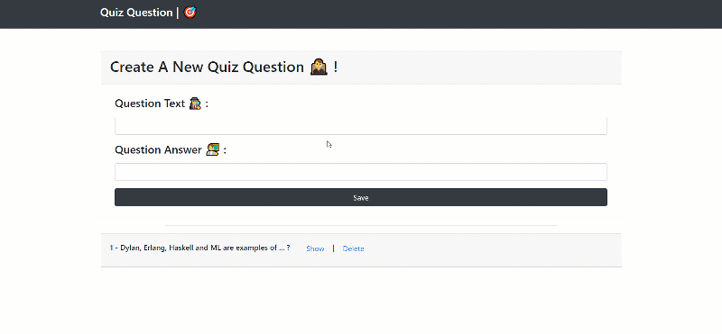

# BASIC-ANGULAR-QUIZ-APP 
---
### This application is a storage of quiz questions in localstorage using angular 2+ ♦️ ...

## What technologies that i used ?
 - Node JS ( Run-Time Environment ) 10.15.0
 - Angular 7.2.0
 - Bootstrap 4.3.1
 - Local Storage 


## Setup prerequists
 - you have to install NodeJS as it's the service and also to use its package manager npm.

## How to run the application
 - Clone or download files in some place.
 - Open CMD or Terminal in the root folder you just cloned.
 - Write this command ``` npm i ``` to install all dependencies then run the app with this command ``` npm run start ```.
 - Open the app in the browser wih port ``` 4200 ```. 


## Demo 

  
#### License
---
[MIT](https://choosealicense.com/licenses/mit/)  

###### (= first angular app =)

